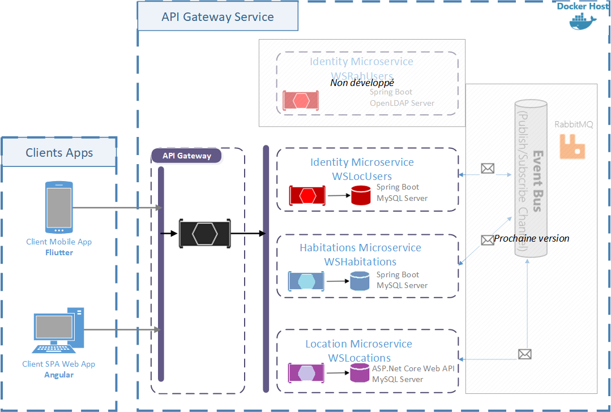
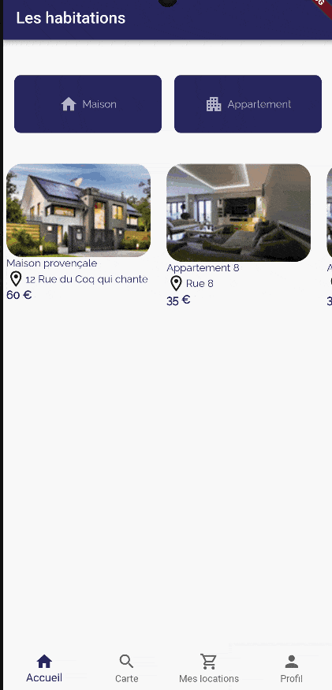

# L'architecture logicielle

## Le projet
Le projet Rent A House
- a pour client
    - Une application mobile **Flutter** 3.13, voir [Mobile RentAHouse](https://gitlab.com/kilroywashere.devops/mrentahouse) 
    - Une application web **Angular** 15.2 LTS, voir [Web RentAHouse](https://gitlab.com/kilroywashere.devops/wrentahouse)
- a des microservices développés
    - en Spring Boot 2.7 et 3.1 avec JPA, JWT, OpenAPI, mise en place de actuator (métriques pour Prometheus)
    - en ASP.Net Core Web API 6.0 avec Entity Framework, JWT, OpenAPI, métrique pour prometheus

### Les microservices

## L'intégration continue
Tous les projets ont le cycle CI/CD avec GitLab.

J'utilise des GitLab Runner pour exécuter des tâches pour Gradle, ASP.Net, Flutter ou le déploiement pour Kubernetes.

### L'application mobile
L'application Flutter utiliser les librairies pour **Cubit**, **Google Map**, les fichiers d'environnements, les Backdrop, SharedPreferences, "carousel slider widget".

L'application mobile permet de :
- lister des habitations 
- localiser les habitations
- afficher le détail d'une habitation
- faire une réservationok.png)
- voir ses locations
- 

### L'application web
