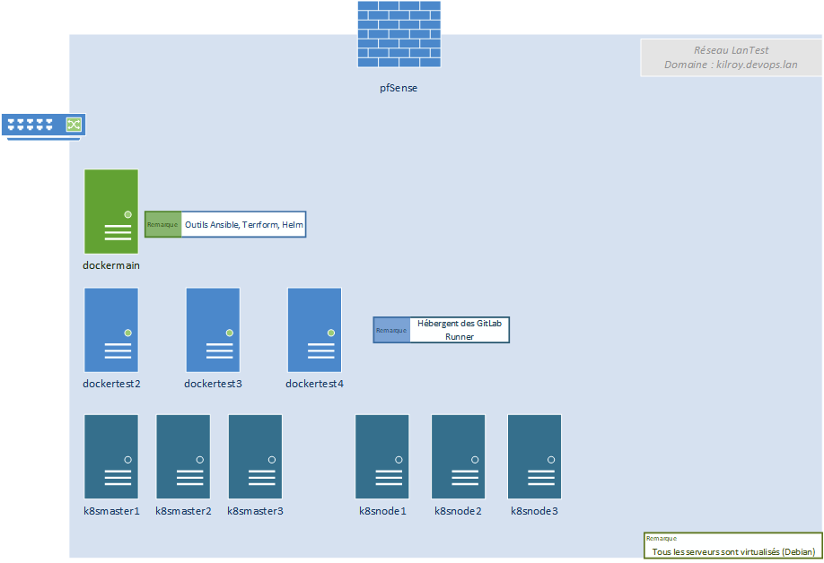

# L'architecture système/réseau

J'ai mis en place une infrastructure système / réseau :
- Virtualisation : VMware ESXi
- Docker
- Kubernetes (`On-Premises`)
- DNS - bind9
- Reverse proxy - nginx, apache
- Monitoring - Prometheus, Grafana
- Message brokers : RabbitMQ
- Parefeu - pfSense

## Physique
L'architecture utilisée est minimale, car il s'agit d'un laboratoire de test.
Elle est composée de
- un accès Internet avec une FreeBox (configurée en bridge)
- un serveur VMware ESXi 6.5 (sur Dell PowerEdge R540), la configuration physique du serveur ne permet pas d'installer une version supérieure.

## Virtualisée

### Les serveurs docker*xxx*
dockermain héberge les conteneurs de l'architecture : DNS, Bases de données ainsi que les outils Ansible, kubectl et Helm.

dockertest*x* héberge les **runners pour Gitlab** : Gradle, Flutter, Dotnet et Kubernetes

### Les servers k8s
Ils hébergent un environnement Kubernetes (`On-Premises`) :
- 3 serveurs maîtres
- 3 serveurs noeuds

### Serveurs docker

Le serveur dockermain a les conteneurs suivants :
- DNS - bind9
- Reverse-proxy : nginx
  - Ce serveur héberge le service nginx proxy pour les accès aux API.
- Annuaire - OpenLDAP

### Serveurs Kubernetes

kubernetes a les conteneurs suivants :
- WSLocUsers (Spring Boot) : gestion des clients
- WSHabitations (ASP.Net Core) : gestion des biens
- WSLocations (Spring Boot) : gestion des locations
- ApiGateway (Spring Boot) : point d'entrée des clients
- **Ingress-nginx** (Helm ingress-nginx/ingress-nginx)
- **Prometheus Cluster** (Helm prometheus-community/kube-prometheus-stack)
- **RabbitMQ Cluster** (Helm bitnami/rabbitmq-cluster-operator)
